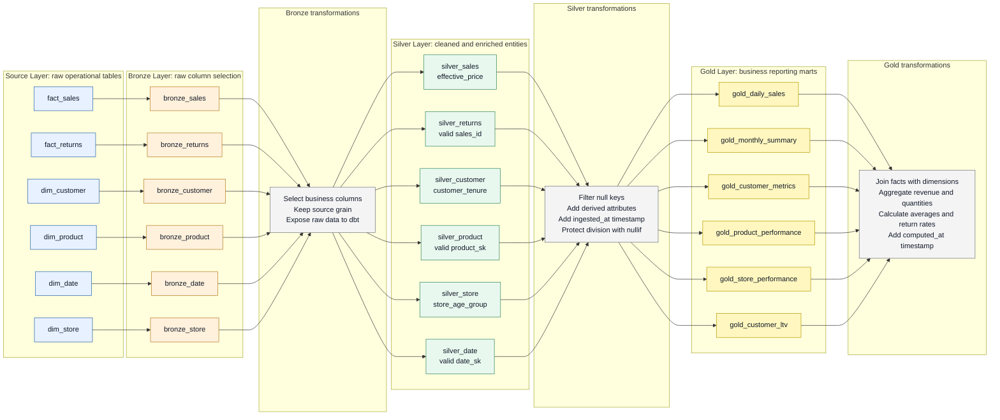
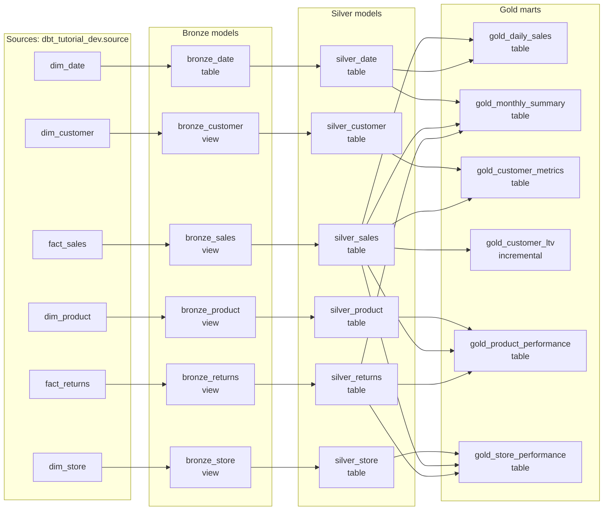
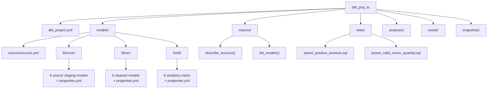

# dbt Project Documentation and Transformation Diagram

## Short Interview Brief

This project is a dbt analytics pipeline built using a medallion-style architecture: Source -> Bronze -> Silver -> Gold.

Raw sales, returns, customer, product, date, and store tables are first registered as dbt sources. The Bronze layer keeps a clean one-to-one copy of the required source columns. The Silver layer applies data quality filters and business enrichment such as effective sales price, customer tenure, store age group, and ingestion timestamps. The Gold layer joins facts with dimensions and creates business-ready reporting marts for daily sales, monthly sales, customer metrics, customer lifetime value, product performance, and store performance.

The final output helps answer business questions like:

- How much revenue did we generate by day or month?
- Which products and stores are performing best?
- What is the return rate by product, store, or month?
- Which customers are most valuable?

## Pictorial Transformation Flow

## Detailed Data Lineage

## Transformations Performed

| Layer | Transformation | Example models |
| --- | --- | --- |
| Source | Defines raw input tables in `sources.yml` | `fact_sales`, `fact_returns`, `dim_customer`, `dim_product`, `dim_date`, `dim_store` |
| Bronze | Selects required source columns and standardizes the dbt entry point for each raw table | `bronze_sales`, `bronze_returns`, `bronze_customer`, `bronze_product`, `bronze_date`, `bronze_store` |
| Silver | Removes records with missing business keys | `silver_sales`, `silver_returns`, `silver_customer`, `silver_product`, `silver_date`, `silver_store` |
| Silver | Adds derived fields for analytics | `effective_price`, `customer_tenure`, `store_age_group` |
| Silver | Adds load metadata | `ingested_at` |
| Gold | Joins fact data with dimensions | sales with date, customer, product, and store context |
| Gold | Aggregates business metrics | transaction counts, units sold, total revenue, lifetime value, refunds, return rates |
| Gold | Adds reporting metadata | `computed_at` |

## Model-Level Explanation

| Model | Inputs | Main transformation | Business use |
| --- | --- | --- | --- |
| `bronze_sales` | `fact_sales` | Selects sales transaction columns | Base sales fact table |
| `silver_sales` | `bronze_sales` | Filters missing `sales_id`, adds `effective_price`, adds `ingested_at` | Clean transaction-level sales data |
| `bronze_returns` | `fact_returns` | Selects return transaction columns | Base returns fact table |
| `silver_returns` | `bronze_returns` | Filters missing `sales_id`, adds `ingested_at` | Clean return-level data |
| `silver_customer` | `bronze_customer` | Filters missing `customer_sk`, derives `customer_tenure` | Customer segmentation |
| `silver_product` | `bronze_product` | Filters missing `product_sk`, adds `ingested_at` | Product dimension for reporting |
| `silver_date` | `bronze_date` | Filters missing `date_sk`, adds `ingested_at` | Calendar dimension for reporting |
| `silver_store` | `bronze_store` | Filters missing `store_sk`, derives `store_age_group` | Store performance segmentation |
| `gold_daily_sales` | `silver_sales`, `silver_date` | Aggregates transactions, customers, units, revenue, average transaction value by day | Daily sales dashboard |
| `gold_monthly_summary` | `silver_date`, `silver_sales`, `silver_returns` | Aggregates monthly revenue, active customers, products sold, stores, refunds, return rate | Monthly executive summary |
| `gold_customer_metrics` | `silver_customer`, `silver_sales` | Calculates orders, units purchased, total spend, average order value, revenue per order | Customer value analysis |
| `gold_customer_ltv` | `silver_sales` | Calculates lifetime value per customer as total net sales | Customer lifetime value analysis |
| `gold_product_performance` | `silver_product`, `silver_sales`, `silver_returns` | Calculates revenue, units sold, average selling price, return quantity, refund amount, return rate | Product performance analysis |
| `gold_store_performance` | `silver_store`, `silver_sales`, `silver_returns` | Calculates store transactions, customers, units, revenue, refunds, return rate | Store performance analysis |

## Simple Talking Points

1. I used dbt to structure the pipeline into Source, Bronze, Silver, and Gold layers.
2. Bronze keeps the raw data shape but selects only the columns needed for analytics.
3. Silver improves data quality by filtering null keys and adding useful business fields.
4. Gold creates final reporting marts with joins and aggregations for sales, returns, customers, customer lifetime value, products, and stores.
5. The project also includes tests for revenue and return quantity checks, plus schema tests in the model properties files.

## Project Layout

